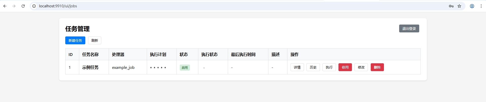

# JobSchedule and JobInstance Detailed Explanation

## Core Concepts

### 1. JobSchedule (Task Scheduling)
`JobSchedule` is the configuration information for scheduled tasks, corresponding to the database table `tb_sys_job_schedule`. It contains the following main fields:

| Field Name | Type | Description |
|-----------|------|-------------|
| Name | string | Task name (unique index) |
| HandlerName | string | Handler name (corresponds to tasks defined in code) |
| Spec | string | Cron expression (scheduled execution rule) |
| Enabled | bool | Whether enabled |
| Description | string | Task description |
| LastRunAt | *time.Time | Last execution time |
| Status | string | Task status |
| LastError | string | Last execution error message |

### 2. JobInstance (Task Instance)
`JobInstance` is the execution instance of a task, corresponding to the database table `tb_sys_job_instance`. It records detailed information about each task execution:

| Field Name | Type | Description |
|-----------|------|-------------|
| JobName | string | Task name |
| JobID | uint | Task ID |
| Status | string | Execution status (running, success, failed) |
| StartedAt | time.Time | Start execution time |
| FinishedAt | *time.Time | End execution time |
| DurationMs | int64 | Execution duration (milliseconds) |
| Error | string | Execution error message |
| LogContent | string | Execution log content |

## How to Enable and Trigger Tasks on the Page

### Step 1: Define a Task in Code
First, you need to implement the `Job` interface to define a task:

```go
package jobs

import (
    "context"
    "fmt"
)

// ExampleJob Example task
type ExampleJob struct{}

// Name Return task name
func (j *ExampleJob) Name() string {
    return "example_job"
}

// Run Execute task logic
func (j *ExampleJob) Run(ctx context.Context) error {
    fmt.Println("Example job is running...")
    return nil
}

// Description Return task description
func (j *ExampleJob) Description() string {
    return "Example task"
}
```

### Step 2: Register Tasks
When the application starts, register tasks with the scheduler:

```go
// register job
jobList := []job.Job{
    &jobs.ExampleJob{},
}

// init router
r := router.NewGinJobRouter(zapLogger, gormDB, cfg, jobList)
r.Start()
```

### Step 3: Manage Tasks in the Web Interface
After the application starts, you can manage tasks through the web interface:



1. **Create Task**:
   - Access the web interface (usually http://localhost:8080)
   - Click the "Create Task" button
   - Fill in the task name, select the handler (ExampleJob), set the Cron expression, description, etc.
   - Click the "Save" button

2. **Enable Task**:
   - Find the newly created task in the task list
   - Click the "Enable" button, and the task will execute automatically according to the set Cron expression

3. **Manually Trigger Task**:
   - Find the task in the task list
   - Click the "Execute Now" button, and the task will execute once immediately without affecting the scheduled execution rules

4. **View Execution History**:
   - On the task details page, you can view all execution instances of the task
   - Click on a specific execution instance to view detailed execution logs and results

### Core API Interfaces

| Interface | Method | Description |
|-----------|--------|-------------|
| /jobs | GET | Get task list |
| /jobs | POST | Create new task |
| /jobs/:name | GET | Get task details |
| /jobs/:name | PUT | Modify task |
| /jobs/:name | DELETE | Delete task |
| /jobs/:name/enable | POST | Enable task |
| /jobs/:name/disable | POST | Disable task |
| /jobs/:name/trigger | POST | Trigger task immediately |
| /jobs/:name/runs | GET | Get task execution history |
| /jobs/:name/runs/:id | GET | Get task execution details |
| /jobs/handlers | GET | Get list of available task handlers |

## Workflow

1. **Task Definition**: Implement the `Job` interface in code
2. **Task Registration**: Register tasks with the scheduler when the application starts
3. **Task Configuration**: Create task schedules (JobSchedule) through the web interface
4. **Task Execution**:
   - Scheduled execution: Automatically execute according to the Cron expression
   - Manual execution: Triggered by the "Execute Now" button
5. **Execution Records**: Each execution creates a JobInstance record
6. **Status Management**: Task status can be controlled through enable/disable interfaces

Through the above workflow, you can define tasks in code and conveniently manage and trigger task execution on the web interface.

## Configuration Instructions

GinJob provides the following configuration options, which you can adjust as needed:

### Configuration Structure

```go
type GinJobConfig struct {
    TemplatePath string    // Template file path
    Auth         GinJobAuth // Authentication information
    Port         string     // Service port
    Gorm         GinJobGorm // Database configuration
}

type GinJobAuth struct {
    Username string // Login username
    Password string // Login password
}

type GinJobGorm struct {
    DSN    string      // Database connection string
    Config *gorm.Config // GORM configuration
}
```

### Default Configuration

GinJob provides a default configuration that you can use directly:

```go
func DefaultConfig() *GinJobConfig {
    templatePath := os.Getenv("TEMPLATE_PATH")
    if templatePath == "" {
        templatePath = "../../templates/*"
    }
    gormConfig := &gorm.Config{}
    dsn := "root:gin-job@tcp(localhost:3306)/gin_job?charset=utf8mb4&parseTime=True&loc=Local"
    return &GinJobConfig{
        Port: ":8080",
        Gorm: GinJobGorm{
            DSN:    dsn,
            Config: gormConfig,
        },
        TemplatePath: templatePath,
        Auth: GinJobAuth{
            Username: "admin",
            Password: "gin-job",
        },
    }
}
```

### Configuration Item Description

| Configuration Item | Type | Default Value | Description |
|-------------------|------|---------------|-------------|
| TemplatePath | string | ../../templates/* | Template file path, can be overridden by the TEMPLATE_PATH environment variable |
| Auth.Username | string | admin | Login username |
| Auth.Password | string | gin-job | Login password |
| Port | string | :8080 | Service port |
| Gorm.DSN | string | root:gin-job@tcp(localhost:3306)/gin_job?charset=utf8mb4&parseTime=True&loc=Local | Database connection string |
| Gorm.Config | *gorm.Config | &gorm.Config{} | GORM configuration object |

### How to Use Configuration

When initializing the GinJob router, you can pass in custom configuration:

```go
// Create custom configuration
customConfig := &config.GinJobConfig{
    Port: ":9090",
    Auth: config.GinJobAuth{
        Username: "custom",
        Password: "custom-password",
    },
    Gorm: config.GinJobGorm{
        DSN: "user:pass@tcp(localhost:3306)/custom_db?charset=utf8mb4&parseTime=True&loc=Local",
    },
}

// Initialize router with configuration
r := router.NewGinJobRouter(customConfig)
r.SetJobList(jobList)
r.Start()
```

If you don't pass in configuration, GinJob will use the default configuration:

```go
// Use default configuration
r := router.NewGinJobRouter(nil)
r.SetJobList(jobList)
r.Start()
```